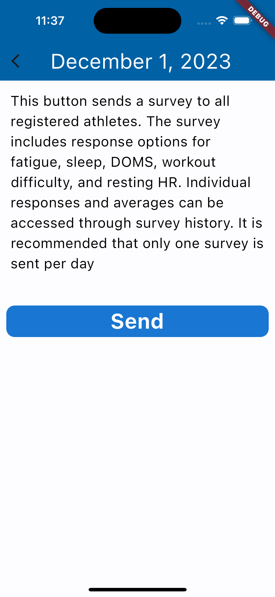
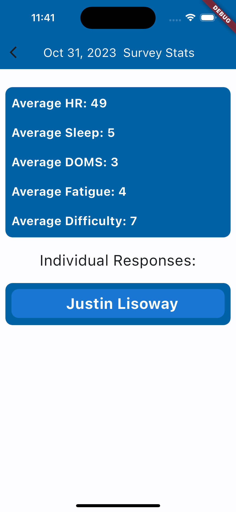

# "Coaching App"

### Website Purpose
This site catalogs links and updates on the progress of the "Coaching App" for Todd Melton.

## Team Introduction
### [Justin Lisoway](https://justinlisoway.github.io/):
I worked one internship in mobile app development as a product tester, and I had continuous communication with the development team. My background is not in CS, but I am in the MS CS program and am developing my software engineering skills. I am familiar with MongoDB, JS, Java, and Python, and I am in a mobile app development class now learning Flutter and Dart.

## Project Overview

In this project, I aim to develop a mobile application for my former swim club. This application will have two different types of users: the coach, and the swimmer.

The first client group (coach) will have a survey screen and a workouts screen. In the survey screen, they can send a new survey to every swimmer, and view past survey data. In the workouts screen, they can view past workouts with metrics (distance, intensity, and duration), view the current workout, and update the current workout for all swimmers to see.

The second group (swimmers) will have a survey screen and a workoutscreen. The survey screen either shows a new unfilled survey, or a message saying they have no new surveys. The workouts screen shows only the current workout.

My techstack will include flutter for frontend and Firebase data management for the backend. I will use the Agile methodology for development with bi-weekly sprints. Each Sprint will conclude with a version of the app that can Demo newly implemented features.

Personally, I have swam competitively for 17 years, the last 7 of which have been scraping at the highest level of competition. Due to this history, I can effectively communicate with the client about the issues he is facing, because I can understand better than other developers the exact problems he is trying to solve. This is an exciting project, because I am able to use over a decade of experience on a topic to create a software product that the vast majority of other developers would have a hard time effectively implementing.

## Sponsor Information

Sponsor: Todd Melton

Mr. Melton is my former swim coach that I will be meeting with on a regular basis to show updates on the app and get continuous feedback. He coached at the Okotoks Mavericks Swim Club for 11 years while I was there and has since started his own online coaching enterprise, which will eventually involve the technology that I am creating for him. He coaches many athletes remotely, and currently lacks a way to efficiently communicate with all of them about their recovery and workouts. Current forms of similar software do not implement “swimming” related metrics. The overarching goal of my app is to fill this need and allow Todd to efficiently send surveys and workouts to all of his swimmers.

## Success Criteria

By December 2nd, 2023, an MVP will be delivered that:

1. Allows a coach to post a swimming workout
2. Allows a group of swimmers to view a swimming workout posted by a coach
3. Allows a coach to survey their athletes on recovery metrics

As of December 1st, 2023 all 3 success criteria have been met and the app's functionality is summarized in the 'Usage' section below.

## Milestones

### Milestone 1: Define User stories, and specify priorities. (October 7)
### Milestone 2: Organize project website and github workflow with a backlog of user stories. (October 7)
### Milestone 3: Wire Framing (October 21)
### Milestone 4: Mockups of all application pages (November 4)
### Milestone 5: Create databases and integrate into mockup pages (November 18)
### Milestone 6: Define User Roles and User authentication using Firebase (November 25)
### Milestone 7: Test Success criteria. Deliver Prototype to the client to test with his athletes (December 2)
### Final Milestone: Continue improving the design of the app based on any client test feedback (End of Semester)

## Usage

When you first open the app, you are asked to sign in or register.

Only valid email addresses that are in the database will allow a user to signin. Users must also verify their email address before being able to sign in. After signing in for the first time, the user is prompted to select their role.

After selection, they are taken to the respective version of the app. There is no way to change a user role in the app after its been initially selected. Upon each sign in thereafter, the user is automatically taken to their respective version of the app without asking for a user role.

### Coach App:

Coaches are shown this home view with tabs for home, history, and settings.

The new workout button shows a create workout screen. Here, a coach can enter the name, date, and description of a workout. After clicking create, the workout will be visible by every athlete using the app. It will also be visible by coaches in the "history" tab.

The new survey button shows a send survey screen. After sending, each athlete will have the ability to respond only once.

The history tab shows a page to view all historical workouts and survey data. Selecting workouts shows all previous workouts organized by date.

Clicking on a workout displays its details.

Selecting surveys shows all previous surveys organized by date.

Selecting a survey shows the average of the responses metrics, and a list of individual responses for the survey.

Selecting an individual response shows that individual's survey response.

The settings tab for the coach simply has a logout button that returns to the signin screen.

### Athlete App:

Athletes are shown this home view with tabs for workouts, survey, and settings.

Clicking on a workout shows its details, similar to a coaches preview shown above. These workouts can be dismissed by sliding them off the screen after completion. The gesture will update the user database to permanently delete the user's view of completed workouts.

The survey tab shows a screen to submit today's survey. If an athlete has already submitted the latest survey, then a screen with a message say so will be shown instead of the option to submit.

The settings page for athletes has the additional feature of editing their name that appears on surveys.

## Repository

[Newest Repository](https://github.com/Coaching-Software/app)

To run this code, clone the main branch of the repository to your local machine and invoke 'flutter run' on the app directory. You may also need to first install flutter and get dependencies by running 'flutter pub get' (this can be done easily with intelliJ). Note: the app is currently mocked-up to look best on the XCODE iOS iPhone 15 simulator, although flexible widgets have been implemented to allow basic functionality on any mobile or desktop screen size.

## [Current Project Board](https://github.com/orgs/Coaching-Software/projects/1/views/1)

## Deployment

The app is currently being deployed only on Apple's Test Flight. Once deployed, a link to download the app to your iOS device will be available by clicking on 'deployment' above.
